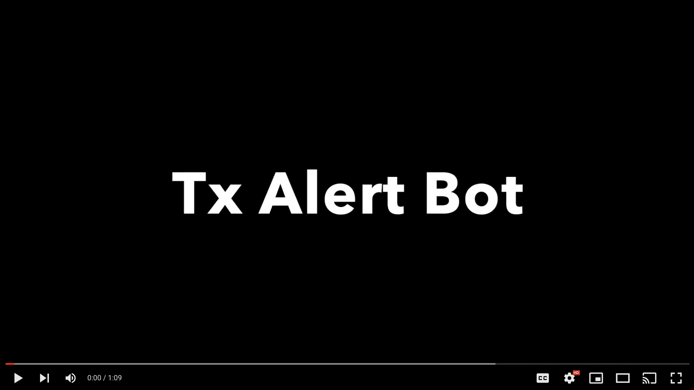

# Mantle Alert Bot

This project is JS based Discord bot build on top of mantle testnet to allow users to easily create discord alerts for: <br>

1. Transactions by an Address
2. Value transfer involving an Address
3. Event emission by an Address

Some of the use cases would include but not be limited to:

1. Security watch for address
2. Whale watch for token transfer
3. Custom event notification by developers for example to state mint starting or contract pause or special events

For example:

Let's say I create a weekly tournament contract and I want my users to be able to be notified when the tournament starts or ends, I'll create a custom event for it and ask them to subscribe to that event using this bot, whenever my contract next emits that event, they'll know the tournament has started or ended.

### Demo - Click on the image

[](https://youtu.be/N4wQVT9U3SM "Demo Video")

### How to use this bot?

This bot can be invited in a server and used there, or it can directly be DM'd for alerts. Do note: the alerts come through DMs whether you use commands on server channels or in DMs.

### Commands

```
/watch-event
```

Allows user to enter any event signature and then proceeds to watch for that event from an address whenever a new block is generated

```
/watch-volume
```

Allows user to watch BIT volume transferred or received by an address above a given amount.

```
/watch
```

Allows user to watch for any transaction by an address

---

**Note**: This bot has been made specifically for Mantle Hackathon UX track and may not be live at all times.
<br><br>
Want to try it out or talk more about it ? <br>
Reach out to me on discord: Ace011#5743
